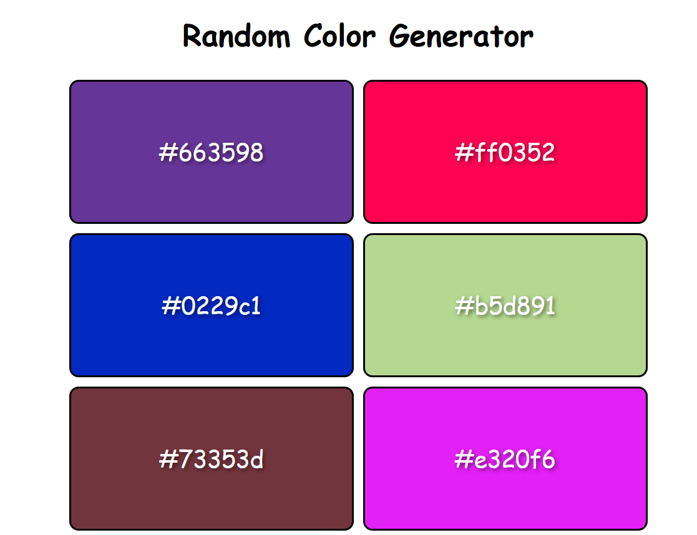

## 🎨 Random Color Generator  

A simple and interactive **Random Color Generator** built using HTML, CSS, and JavaScript. This tool generates random colors instantly and provides their HEX values.  

## 🚀 Features  
- ✅ Generate random colors   
- ✅ Display color codes in HEX formats  
- ✅ Copy color codes to the clipboard  
- ✅ Responsive and lightweight design  

## 🛠 Tech Stack  
HTML, CSS, JavaScript  

## 📷 Screenshots  
  

## 📌 How to Use  
1. Load page to get a new random color palette.  
2. View the color along with its HEX codes.  
3. Copy the color code and use it anywhere.  

## 📥 Download & Installation  
Clone the repository using Git:  
```bash
git clone https://github.com/aklema094/Random-Color-Generator.git
```  
Or download the ZIP file manually from [here](https://github.com/aklema094/Random-Color-Generator/archive/refs/heads/main.zip).  
